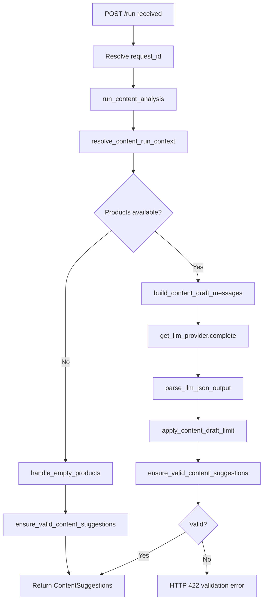
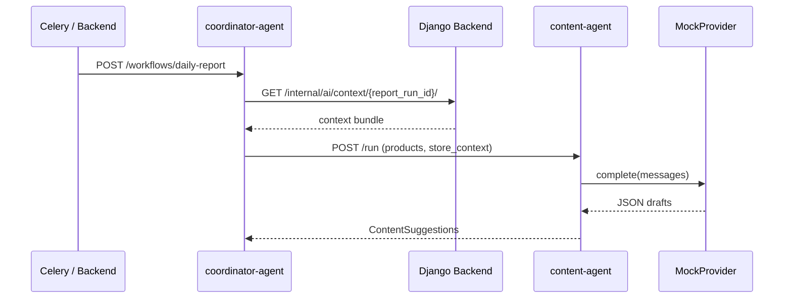

# Content Agent

## 1. Purpose

The **content-agent** (`SERVICE_NAME = "content-agent"`) generates reviewable marketing content drafts for a store based on product and store context. It produces schema-validated `ContentSuggestions` containing Instagram caption drafts and product description drafts. All drafts require manager approval before external use; the agent does not publish content or execute external side effects.

Primary responsibilities (from `agents/content/analysis.py` and `agents/content/app/main.py`):

- Resolve product/store context from request fields or a coordinator-provided context bundle.
- Return a deterministic empty result when no products are available (no LLM call).
- Build prompts with brand voice and draft-limit instructions.
- Call the configured LLM provider (`MockProvider` by default).
- Parse, apply per-run draft limits, and schema-validate output before returning.

## 2. Current Implementation Summary

### FastAPI app structure

| Item | Location |
|------|----------|
| App entrypoint | `agents/content/app/main.py` — `app = FastAPI(title="content-agent")` |
| Request schemas | `agents/content/app/schemas.py` — `ContentRunRequest` |
| Response schema | `agents/shared/schemas/content.py` — `ContentSuggestions` |
| Runtime pipeline | `agents/content/analysis.py` — `run_content_analysis()` |
| Default port (Docker) | `8102` (`docker-compose.yml`) |

### Main modules/files

| Module | Role |
|--------|------|
| `agents/content/analysis.py` | Pipeline orchestration: context resolution → empty check → LLM → draft limit → validation |
| `agents/content/product_context.py` | `resolve_content_run_context()` — merges explicit args with coordinator `context` |
| `agents/content/empty_products.py` | `handle_empty_products()` — deterministic no-product fallback |
| `agents/content/prompts.py` | `build_content_draft_messages()` — brand voice + action-type instructions |
| `agents/content/brand_voice.py` | Brand voice extraction from `store_context.settings` |
| `agents/content/draft_limit.py` | `resolve_max_drafts_per_run()`, `limit_content_suggestions()` |
| `agents/content/validation.py` | JSON parse, `ensure_valid_content_suggestions()`, safe logging |
| `agents/content/action_mapping.py` | Maps `ContentDraft` → Django action payloads (not wired to `/run` endpoint) |

### Routers/endpoints

All routes are defined directly on `app` in `agents/content/app/main.py`. No separate APIRouter modules.

### Services/helpers

- `agents/shared/llm/provider.py` — `get_llm_provider()` (mock only in current code).
- `agents/shared/language.py` — `get_output_language()`, `normalize_output_language()`.
- `agents/shared/schemas/validation.py` — `validate_agent_response()` (strict `extra="forbid"`).

### External dependencies

- **LLM**: `MockProvider` via `LLM_PROVIDER=mock` (only implemented provider).
- **Django**: Not called from the content-agent `/run` endpoint. Context is expected in the request body (typically from the coordinator context bundle).
- **Other agents**: No outbound calls to sales, support, or coordinator.

### Environment variables

| Variable | Used by | Default / behavior |
|----------|---------|-------------------|
| `LLM_PROVIDER` | `get_llm_provider()` | `mock` |
| `AI_OUTPUT_LANGUAGE` | `get_output_language()` when request omits `output_language` | `fa` |
| `CONTENT_AGENT_MAX_DRAFTS_PER_RUN` | `draft_limit.resolve_max_drafts_per_run()` | `3` (clamped 1–5) |

### Integrations

- Invoked by **coordinator-agent** via `POST /run` with products and store context extracted from the Django context bundle (`agents/coordinator/nodes.py` — `_content_specialist_payload()`).
- Action mapping helpers exist (`agents/content/action_mapping.py`) but are **not** invoked by the FastAPI `/run` handler.

## 3. Public API / Endpoints

| Method | Path | Auth | Response model |
|--------|------|------|----------------|
| `GET` | `/health` | None | `{"status": "ok", "service": "content-agent"}` |
| `GET` | `/` | None | `{"service": "content-agent", "message": "placeholder"}` |
| `POST` | `/run` | Optional `X-Request-ID` header | `ContentSuggestions` |

### `POST /run`

**Request body** (`ContentRunRequest`):

| Field | Type | Required | Description |
|-------|------|----------|-------------|
| `context` | `dict` | Optional | Coordinator/Django context bundle |
| `products` | `list[dict]` | Optional | Product list; merged with `context` |
| `store_context` | `dict` | Optional | Store display name, `settings`, brand voice |
| `campaign_angle` | `str` | Optional | Campaign focus for drafts |
| `report_run_id` | `str` | Optional | Attached to response metadata |
| `output_language` | `str` | Optional | `fa` or `en`; defaults via `AI_OUTPUT_LANGUAGE` |
| `max_drafts_per_run` | `int` | Optional | Per-run draft cap (overrides store/env) |
| `request_id` | `str` | Optional | Correlation ID; also accepted via header |

**Headers**:

| Header | Required | Notes |
|--------|----------|-------|
| `X-Request-ID` | Optional | Overrides `payload.request_id` when present |
| `Authorization` | Not used | Not found in current code for content-agent |

**Response** (`ContentSuggestions`): see [Data Contracts](#10-data-contracts).

**Status codes**:

| Code | When |
|------|------|
| `200` | Successful analysis |
| `422` | `AgentSchemaValidationError` or `ContentLLMOutputError` — detail includes `code`, `message`, and optionally `schema_name` / `field_errors` |
| `422` | FastAPI/Pydantic request validation failure (invalid request body) |

**Side effects**: INFO log (`"Content analysis run requested"`). No database writes, no Django calls, no external publishing.

## 4. Inputs

| Input | Type | Required | Validation | Used in |
|-------|------|----------|------------|---------|
| `context` | `dict` | Optional | Strict model (`extra="forbid"`) | `resolve_content_run_context()` |
| `products` | `list[dict]` | Optional | Strict model | Product list for prompts |
| `store_context` | `dict` | Optional | Strict model | Brand voice, draft limit from `settings` |
| `campaign_angle` | `str` | Optional | — | Prompt construction |
| `report_run_id` | `str` | Optional | — | Metadata, logging |
| `output_language` | `str` | Optional | Normalized to `fa`/`en` via `normalize_output_language()` | Prompts and response |
| `max_drafts_per_run` | `int` | Optional | Resolved/clamped in `draft_limit.py` | Post-LLM draft trimming |
| `request_id` | `str` / header | Optional | — | Logging, correlation |
| `AI_OUTPUT_LANGUAGE` | env | Optional | Default `fa` | When `output_language` omitted |
| `LLM_PROVIDER` | env | Optional | Default `mock` | LLM selection |
| `CONTENT_AGENT_MAX_DRAFTS_PER_RUN` | env | Optional | Clamped 1–5 | Draft limit fallback |
| Coordinator context bundle | Internal | Inferred from code | Products under `context.products.items`, store under `context.store` | When called by coordinator |

## 5. Outputs

| Output | Shape | When | Consumer |
|--------|-------|------|----------|
| `ContentSuggestions` HTTP response | JSON | Successful `/run` | Coordinator, tests, direct API clients |
| `422` error detail | `{code, message, schema_name?, field_errors?}` | Validation/LLM parse failure | API client |
| INFO logs | Structured `extra` with `service`, `report_run_id`, `request_id` | Each `/run` request | Log aggregation |
| WARNING logs | Validation failure summary (no full payloads) | LLM output invalid | `log_content_validation_failure()` |

No database writes, queue messages, or file artifacts are produced by the content-agent service itself.

## 6. Behavior Flow

1. **Request received** — `run_content_agent()` in `main.py` resolves `request_id` from `X-Request-ID` or body.
2. **Pipeline entry** — `run_content_analysis()` is called with all request fields.
3. **Context resolution** — `resolve_content_run_context()` merges `context`, `products`, `store_context`, `campaign_angle`.
4. **Language** — `_resolve_output_language()` uses request override or `get_output_language()`.
5. **Empty products** — `handle_empty_products()` returns deterministic result without LLM if no products; validated and returned.
6. **LLM path** — `build_content_draft_messages()` → `llm_provider.complete()` → `parse_llm_json_output()`.
7. **Draft limit** — `apply_content_draft_limit()` trims `drafts` list per resolved max.
8. **Validation** — `ensure_valid_content_suggestions()` via shared Pydantic schemas.
9. **Metadata enrichment** — `report_run_id` and `output_language` backfilled if missing.
10. **Response** — `ContentSuggestions` returned; validation errors become HTTP 422.

## 7. Flowchart

## 8. Sequence Diagram

When invoked by the coordinator during a daily report:

Direct `/run` calls without the coordinator skip Django and coordinator steps.

## 9. Error Handling

| Error path | Behavior |
|------------|----------|
| Invalid request body | FastAPI returns `422` with Pydantic validation errors |
| `ContentLLMOutputError` | HTTP `422`, `code: "llm_output_invalid"` |
| `AgentSchemaValidationError` | HTTP `422`, `code: "schema_validation_failed"`, includes `field_errors` |
| Unsupported `LLM_PROVIDER` | `NotImplementedError` from `get_llm_provider()` — not caught in content `main.py`; would surface as HTTP 500 (Inferred from code: content endpoint does not catch `NotImplementedError`) |
| Empty products | Deterministic valid response, not an error |
| Django fetch | Not performed by content-agent endpoint |

No retry logic inside the content-agent. Timeout/retry behavior is the caller's responsibility (coordinator applies per-node timeouts).

## 10. Data Contracts

### `ContentRunRequest` (`agents/content/app/schemas.py`)

| Field | Type | Required | Default | Description |
|-------|------|----------|---------|-------------|
| `context` | `dict[str, Any] \| None` | Optional | `None` | Coordinator context bundle |
| `products` | `list[dict] \| None` | Optional | `None` | Explicit product list |
| `store_context` | `dict[str, Any] \| None` | Optional | `None` | Store settings and display name |
| `campaign_angle` | `str \| None` | Optional | `None` | Campaign focus |
| `report_run_id` | `str \| None` | Optional | `None` | Report run correlation |
| `output_language` | `str \| None` | Optional | `None` | `fa` or `en` |
| `max_drafts_per_run` | `int \| None` | Optional | `None` | Draft count override |
| `request_id` | `str \| None` | Optional | `None` | Correlation ID |

### `ContentSuggestions` (`agents/shared/schemas/content.py`)

| Field | Type | Required | Default | Description |
|-------|------|----------|---------|-------------|
| `metadata` | `AgentResponseMetadata` | Required | — | `agent_name`, optional `report_run_id` |
| `warnings` | `list[AgentWarning]` | Optional | `[]` | Pipeline warnings |
| `summary` | `str` | Required | — | Manager-facing summary (min length 1) |
| `drafts` | `list[ContentDraft]` | Optional | `[]` | Content draft suggestions |
| `output_language` | `str \| None` | Optional | `None` | Response language |

### `ContentDraft`

| Field | Type | Required | Default | Description |
|-------|------|----------|---------|-------------|
| `action_type` | `"content.instagram_draft" \| "content.product_description"` | Required | — | Allowed action types only |
| `title` | `str` | Required | — | Draft title |
| `description` | `str` | Required | — | Short description |
| `draft_text` | `str` | Required | — | Generated content body |
| `rationale` | `str` | Required | — | Why this draft was suggested |
| `product_id` | `str \| None` | Optional | `None` | Required when `action_type` is `content.product_description` |
| `campaign_angle` | `str \| None` | Optional | `None` | Campaign context |
| `priority` | `int \| None` | Optional | `None` | 1–5 if set |
| `requires_approval` | `bool` | Required | `True` | Must be `True` (validator enforces) |
| `payload` | `dict` | Optional | `{}` | Extra structured fields |
| `output_language` | `str \| None` | Optional | `None` | Per-draft language |

## 11. Dependencies and Integrations

### Python packages (`agents/content/requirements.txt`)

- `fastapi==0.115.6`
- `pydantic==2.10.4`
- `uvicorn[standard]==0.32.1`

### Internal modules

- `agents/shared/schemas/content.py`, `agents/shared/schemas/base.py`, `agents/shared/schemas/validation.py`
- `agents/shared/llm/mock.py`, `agents/shared/llm/provider.py`
- `agents/shared/language.py`

### Backend endpoints

Not called directly by content-agent `/run`. Coordinator fetches context from Django and passes it in the request.

### Other agents

- Called by **coordinator-agent** only (star topology). Content-agent does not call other agents.

### Environment variables

`LLM_PROVIDER`, `AI_OUTPUT_LANGUAGE`, `CONTENT_AGENT_MAX_DRAFTS_PER_RUN`

## 12. Current Limitations

- **No Django integration on `/run`** — `action_mapping.py` exists but is not wired to the HTTP endpoint; coordinator sets `persist_actions: False` for content runs.
- **Mock LLM only** — `get_llm_provider()` raises `NotImplementedError` for non-`mock` providers.
- **No `Authorization` header handling** — unlike sales/support agents.
- **Placeholder root endpoint** — `GET /` returns `"message": "placeholder"`.
- **Coordinator hardcodes `output_language: "en"`** for specialist payloads (`agents/coordinator/nodes.py` — `_base_specialist_payload()`), which may override tenant Persian default unless the content pipeline re-resolves language (Inferred from code: request `output_language` from coordinator is `"en"`).
- **Strict schemas** — unknown fields in request/response bodies are rejected.

## 13. Frontend-Relevant Notes

- **Usable endpoint**: `POST /run` for on-demand content generation (primarily used by coordinator, not directly by frontend in current architecture).
- **Display fields**: `summary`, `drafts[].title`, `drafts[].description`, `drafts[].draft_text`, `drafts[].action_type`, `drafts[].priority`, `warnings[]`.
- **Approval UX**: All drafts have `requires_approval: true`; UI should treat them as review-only, not publishable.
- **Errors**: Show `422` validation messages; `field_errors` array maps to form-level hints if building a manual test UI.
- **Language**: Pass `output_language: "fa"` or `"en"` or rely on server `AI_OUTPUT_LANGUAGE`.
- **Async behavior**: Synchronous request/response; no progress/streaming endpoint.
- **Auth**: No auth on content-agent endpoints in current code; service-to-service auth is handled at coordinator/Django layer.

## 14. Verification Checklist

- [x] Agent directory inspected
- [x] FastAPI routes documented
- [x] Inputs documented
- [x] Outputs documented
- [x] Main behavior flow documented
- [x] Flowchart added
- [x] Error handling documented
- [x] Frontend-relevant notes added
- [x] No application code changed
