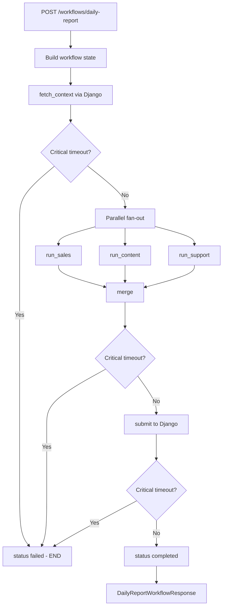
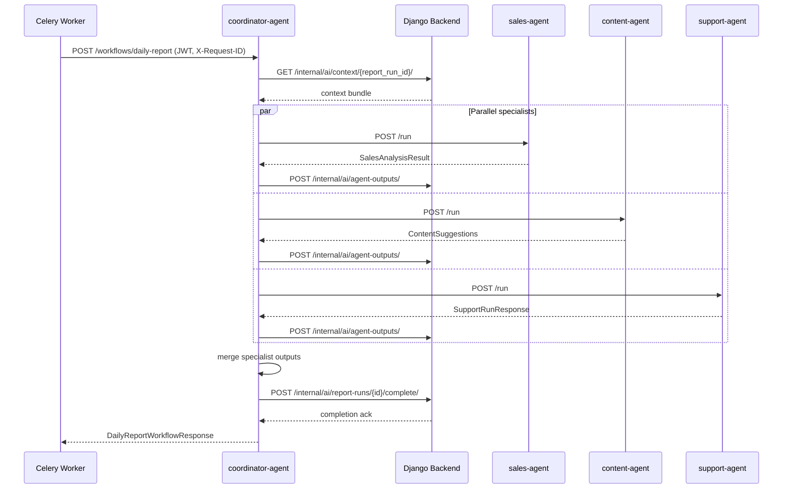

# Coordinator Agent

## 1. Purpose

The **coordinator-agent** (`SERVICE_NAME = "coordinator-agent"`) orchestrates the daily report workflow. It is the only service that calls specialist agents (sales, content, support) in a star topology. It fetches sanitized context from Django, runs specialist agents in parallel, merges their outputs, persists intermediate `AgentOutput` records, and submits the final daily report completion to Django.

Primary responsibilities (from `agents/coordinator/app/main.py`, `agents/coordinator/graph.py`, `agents/coordinator/nodes.py`):

- Accept daily report job requests from Celery/backend via `POST /workflows/daily-report`.
- Execute LangGraph workflow: `fetch_context` → parallel `run_sales` / `run_content` / `run_support` → `merge` → `submit`.
- Apply per-node timeouts with partial-failure tolerance for specialist nodes.
- Forward service JWT and `X-Request-ID` to Django and specialist agents.
- Never auto-approve or execute actions.

## 2. Current Implementation Summary

### FastAPI app structure

| Item | Location |
|------|----------|
| App entrypoint | `agents/coordinator/app/main.py` |
| Workflow handler | `agents/coordinator/app/workflow_endpoint.py` |
| Request/response schemas | `agents/coordinator/app/schemas.py` |
| LangGraph workflow | `agents/coordinator/graph.py` |
| Node implementations | `agents/coordinator/nodes.py` |
| Workflow runner | `agents/coordinator/runner.py` |
| Default port (Docker) | `8100` |

### Main modules/files

| Module | Role |
|--------|------|
| `agents/coordinator/graph.py` | LangGraph `StateGraph` compile and invoke |
| `agents/coordinator/nodes.py` | Six workflow nodes with timeout boundaries |
| `agents/coordinator/merge.py` | `build_merged_daily_report()` |
| `agents/coordinator/specialist_clients.py` | HTTP client for specialist `POST /run` |
| `agents/coordinator/topology.py` | Star topology URLs and agent name validation |
| `agents/coordinator/agent_output_persistence.py` | Django `AgentOutput` persistence |
| `agents/coordinator/config.py` | Per-node timeout env configuration |
| `agents/coordinator/timeout.py` | `run_with_node_timeout()` |
| `agents/coordinator/state.py` | `DailyReportWorkflowState` dataclass |

### Routers/endpoints

Routes defined on `app` in `agents/coordinator/app/main.py`.

### External dependencies

- **Django**: context bundle, agent output persistence, report completion.
- **Specialist agents**: sales-agent `:8101`, content-agent `:8102`, support-agent `:8103`.
- **LangGraph**: workflow compilation and parallel fan-out.

### Environment variables

| Variable | Default | Purpose |
|----------|---------|---------|
| `DJANGO_INTERNAL_BASE_URL` | — | Django client base URL (required for workflow) |
| `DJANGO_CLIENT_TIMEOUT_SECONDS` | `30` | Django HTTP timeout |
| `DJANGO_CLIENT_MAX_RETRIES` | `2` | GET retry count |
| `DJANGO_CLIENT_RETRY_BACKOFF_SECONDS` | `0.25` | Retry backoff |
| `SALES_AGENT_URL` | `http://sales-agent:8101` | Sales specialist base URL |
| `CONTENT_AGENT_URL` | `http://content-agent:8102` | Content specialist base URL |
| `SUPPORT_AGENT_URL` | `http://support-agent:8103` | Support specialist base URL |
| `COORDINATOR_FETCH_CONTEXT_TIMEOUT_SECONDS` | `30` | `fetch_context` node timeout |
| `COORDINATOR_SALES_TIMEOUT_SECONDS` | `60` | `run_sales` node timeout |
| `COORDINATOR_CONTENT_TIMEOUT_SECONDS` | `60` | `run_content` node timeout |
| `COORDINATOR_SUPPORT_TIMEOUT_SECONDS` | `60` | `run_support` node timeout |
| `COORDINATOR_MERGE_TIMEOUT_SECONDS` | `30` | `merge` node timeout |
| `COORDINATOR_SUBMIT_TIMEOUT_SECONDS` | `30` | `submit` node timeout |
| `LLM_PROVIDER` | `mock` | Used indirectly via specialist agents |

Service JWT is passed per request via `Authorization: Bearer` header, not from a fixed env var on the coordinator itself.

## 3. Public API / Endpoints

| Method | Path | Auth | Response model |
|--------|------|------|----------------|
| `GET` | `/health` | None | `{"status": "ok", "service": "coordinator-agent"}` |
| `GET` | `/` | None | Placeholder message |
| `POST` | `/workflows/daily-report` | Optional `Authorization: Bearer`, `X-Request-ID` | `DailyReportWorkflowResponse` |

### `POST /workflows/daily-report`

**Request body** (`DailyReportJobRequest`):

| Field | Type | Required | Description |
|-------|------|----------|-------------|
| `report_run_id` | `UUID` | **Required** | Report run identifier |
| `tenant_id` | `UUID` | **Required** | Tenant scope |
| `store_id` | `UUID` | **Required** | Store scope |
| `context_ref` | `ContextRef` | **Required** | `{type: "report_run", id: UUID}` — `id` must equal `report_run_id` |
| `request_id` | `str` | Optional | Correlation ID |
| `period` | `str` | Optional | Not used in workflow nodes (accepted only) |
| `requested_by` | `str` | Optional | Not used in workflow nodes (accepted only) |

**Headers**:

| Header | Required | Notes |
|--------|----------|-------|
| `Authorization` | Optional | `Bearer <service_jwt>` forwarded to Django and specialists |
| `X-Request-ID` | Optional | Correlation ID; falls back to `request_id` in body |

**Auth validation**: If `Authorization` is present but does not start with `Bearer `, HTTP `401` is returned. JWT is not validated inside the coordinator FastAPI app (Inferred from code: no decode/verify step in `main.py`).

**Response** (`DailyReportWorkflowResponse`):

| Field | Type | Description |
|-------|------|-------------|
| `status` | `"completed" \| "failed"` | Workflow outcome |
| `workflow` | `"daily_report"` | Fixed workflow name |
| `report_run_id` | `str` | UUID string |
| `message` | `str` | Human-readable outcome message |
| `warnings` | `list[AgentWarning]` | Accumulated workflow warnings |
| `partial` | `bool` | `true` when specialist sections missing |

**Status codes**:

| Code | When |
|------|------|
| `200` | Workflow completed or failed gracefully with structured response |
| `401` | Malformed `Authorization` header (non-Bearer) |
| `422` | Invalid request body (Pydantic), e.g. `context_ref.id` mismatch |

**Side effects**:

- Django `GET /internal/ai/context/{report_run_id}/`
- Three specialist `POST /run` calls (parallel after fetch)
- Up to three Django `POST /internal/ai/agent-outputs/`
- Django `POST /internal/ai/report-runs/{id}/complete/` with merged report
- INFO logs with report/tenant/store IDs (no raw JWT logged)

## 4. Inputs

| Input | Type | Required | Used in |
|-------|------|----------|---------|
| `DailyReportJobRequest` body | Pydantic model | Required | Workflow state initialization |
| `Authorization` header | `Bearer` JWT | Optional | `DjangoClient`, `SpecialistAgentClient` |
| `X-Request-ID` header | `str` | Optional | Correlation across services |
| Django context bundle | `dict` | Fetched | Specialist payloads, merge |
| Specialist agent JSON responses | `dict` | From HTTP | Merge, persistence |
| Timeout env vars | `float` | Optional | Per-node boundaries |

## 5. Outputs

| Output | Shape | When | Consumer |
|--------|-------|------|----------|
| `DailyReportWorkflowResponse` | JSON | HTTP response | Celery task, backend |
| Merged daily report | `dict` | `submit` node | Django `complete_report_run` |
| `AgentOutput` records | Django IDs in `agent_outputs_ref` | After each successful specialist node | Django DB |
| Workflow `warnings` | `AgentWarning[]` | Timeouts, persistence failures, partial runs | Response + merged report `warnings` |
| Specialist timeout warnings | `specialist_node_timeout` | Specialist exceeds timeout | Partial report continues |
| Critical failure | `status: "failed"` | `fetch_context`, `merge`, or `submit` timeout | Celery failure handling |

### Merged report shape (`build_merged_daily_report`)

| Field | Description |
|-------|-------------|
| `report_run_id`, `store_id`, `generated_at`, `period` | Report metadata |
| `sales_summary` | From context or sales output |
| `prioritized_actions` | From sales recommendations |
| `content_suggestions` | Draft previews from content output |
| `support_insights` | Themes/summaries from support output |
| `next_steps` | Manager review guidance |
| `agent_outputs_ref` | Persisted AgentOutput UUIDs |
| `warnings` | Serialized workflow warnings |
| `sections`, `missing_sections`, `partial` | Partial completion metadata |

## 6. Behavior Flow

1. **HTTP handler** — `trigger_daily_report_workflow()` validates auth scheme, logs context, calls `execute_daily_report_workflow()`.
2. **State build** — `build_workflow_state_from_request()` creates `DailyReportWorkflowState`.
3. **LangGraph invoke** — `invoke_daily_report_graph()` runs compiled graph:
   - **`fetch_context`** (critical): Django `get_context_bundle()`. Timeout → workflow `failed`, graph ends.
   - **Parallel fan-out**: `run_sales`, `run_content`, `run_support` call specialist `POST /run` with tailored payloads. Timeout → warning, no output for that section; workflow continues.
   - **`merge`** (critical): `build_merged_daily_report()`. Timeout → workflow `failed`.
   - **`submit`** (critical): Django `complete_report_run()`. Timeout → workflow `failed`.
4. **AgentOutput persistence** — After each successful specialist call, `persist_specialist_agent_output()` POSTs to Django; failures add warnings but retain in-memory specialist result.
5. **Response build** — `build_workflow_response()` maps final state to `DailyReportWorkflowResponse`.
6. **Unexpected exceptions** — Caught in `execute_daily_report_workflow()`; returns `status: "failed"` with generic message (no stack trace to client).

### Specialist payload defaults (`_base_specialist_payload`)

| Flag | Value | Effect |
|------|-------|--------|
| `fetch_from_django` | `False` | Specialists use coordinator-provided context only |
| `persist_actions` | `False` | No action POSTs from specialists |
| `dry_run` | `True` | Specialists would not POST even if persist enabled |
| `output_language` | `"en"` | Passed to all specialists |

## 7. Flowchart

## 8. Sequence Diagram

## 9. Error Handling

| Error path | Behavior |
|------------|----------|
| Invalid request body | HTTP `422` (Pydantic), e.g. `context_ref.id` ≠ `report_run_id` |
| Non-Bearer `Authorization` | HTTP `401` |
| `fetch_context` timeout | `failed=true`, `status="failed"`, warning `critical_node_timeout`, graph END |
| Specialist node timeout | Warning `specialist_node_timeout`, warning `agent_output_not_persisted`, partial report |
| Specialist HTTP error | Not explicitly caught in `nodes.py` — would propagate as exception (Inferred from code: `_run_specialist_node` only catches `CoordinatorNodeTimeoutError`; HTTP errors from `SpecialistAgentClient` may fail the node uncaught) |
| `merge` / `submit` timeout | Critical failure, workflow `failed` |
| `submit` without merged report | `failed=true`, message `"Cannot submit daily report without merged content."` |
| AgentOutput persistence failure | Warning `agent_output_persistence_failed`, workflow continues |
| Unexpected exception in `execute_daily_report_workflow` | HTTP `200` with `status: "failed"`, message `"Daily report workflow failed unexpectedly."` |

Specialist HTTP/connection errors: **Not found in current code** as explicitly handled in `_run_specialist_node`; may abort the graph invocation depending on LangGraph error propagation.

## 10. Data Contracts

### `ContextRef`

| Field | Type | Required |
|-------|------|----------|
| `type` | `"report_run"` | Required |
| `id` | `UUID` | Required — must match `report_run_id` |

### `DailyReportJobRequest`

| Field | Type | Required |
|-------|------|----------|
| `report_run_id` | `UUID` | Required |
| `tenant_id` | `UUID` | Required |
| `store_id` | `UUID` | Required |
| `context_ref` | `ContextRef` | Required |
| `request_id` | `str \| None` | Optional |
| `period` | `str \| None` | Optional |
| `requested_by` | `str \| None` | Optional |

### `DailyReportWorkflowResponse`

| Field | Type | Required | Default |
|-------|------|----------|---------|
| `status` | `"completed" \| "failed"` | Required | — |
| `workflow` | `"daily_report"` | Required | — |
| `report_run_id` | `str` (UUID) | Required | — |
| `message` | `str` | Required | — |
| `warnings` | `list[AgentWarning]` | Optional | `[]` |
| `partial` | `bool` | Optional | `False` |

### `DailyReportWorkflowState` (internal)

Key fields: `report_run_id`, `tenant_id`, `store_id`, `service_token`, `request_id`, `context`, `sales_output`, `content_output`, `support_output`, `agent_outputs_ref`, `merged_report`, `submit_result`, `warnings`, `failed`, `error_message`, `status`.

### `AgentWarning`

| Field | Type |
|-------|------|
| `code` | `str` |
| `message` | `str` |

## 11. Dependencies and Integrations

### Python packages (`agents/coordinator/requirements.txt`)

- `fastapi==0.115.6`
- `httpx==0.28.1`
- `langgraph==0.2.76`
- `pydantic==2.10.4`
- `uvicorn[standard]==0.32.1`

### Django internal endpoints

| Method | Path | Node |
|--------|------|------|
| `GET` | `/internal/ai/context/{report_run_id}/` | `fetch_context` |
| `POST` | `/internal/ai/agent-outputs/` | After each specialist node |
| `POST` | `/internal/ai/report-runs/{report_run_id}/complete/` | `submit` |

### Specialist agents (star topology)

| Agent | URL env | Endpoint |
|-------|---------|----------|
| sales-agent | `SALES_AGENT_URL` | `POST /run` |
| content-agent | `CONTENT_AGENT_URL` | `POST /run` |
| support-agent | `SUPPORT_AGENT_URL` | `POST /run` |

Specialist agents do not call each other (`SPECIALIST_PEER_CALL_PATHS` is empty in `topology.py`).

### Shared modules

- `agents/shared/django_client/client.py`
- `agents/shared/schemas/base.py`

## 12. Current Limitations

- **No in-app JWT validation** — malformed scheme rejected; token validity enforced by Django/specialists.
- **Specialist HTTP errors not converted to warnings** — unlike timeouts, non-2xx specialist responses may not produce partial reports (ambiguous — see Error Handling).
- **Specialists run with `dry_run: True`** — actions are not persisted through specialist agents during daily reports.
- **Support fallback message** — if context has no customer messages, coordinator sends `"What are your store hours?"` (`_derive_support_message_from_context`).
- **Content store_context default** — coordinator supplies `{"settings": {"brand_voice": {"tone": "warm"}}}` when store settings missing.
- **`period` / `requested_by` request fields** — accepted but not passed to workflow logic.
- **Placeholder `GET /`** endpoint.
- **LangGraph required** — coordinator cannot run workflow without `langgraph` package.

## 13. Frontend-Relevant Notes

- **Frontend does not call coordinator directly** in current architecture — Celery/backend triggers `POST /workflows/daily-report`.
- **Dashboard data** comes from Django after `submit` completes (`DailyReport`, `ReportRun` status), not from coordinator response alone.
- **Response fields for ops UI**: `status`, `partial`, `warnings`, `message`, `report_run_id`.
- **Partial reports**: When `partial: true`, UI should show `warnings` and `missing_sections` from the stored DailyReport (in Django), not only coordinator HTTP response.
- **No progress/streaming** — workflow is synchronous from Celery's perspective; long-running requests depend on HTTP timeouts.
- **Auth**: Service JWT required for Django writes; frontend user JWT is not used on coordinator endpoint in current code.

## 14. Verification Checklist

- [x] Agent directory inspected
- [x] FastAPI routes documented
- [x] Inputs documented
- [x] Outputs documented
- [x] Main behavior flow documented
- [x] Flowchart added
- [x] Error handling documented
- [x] Frontend-relevant notes added
- [x] No application code changed
