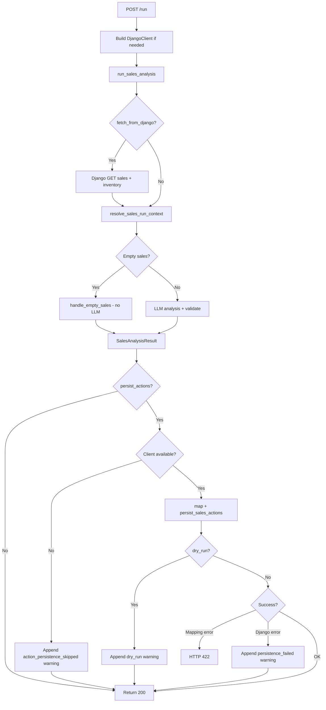
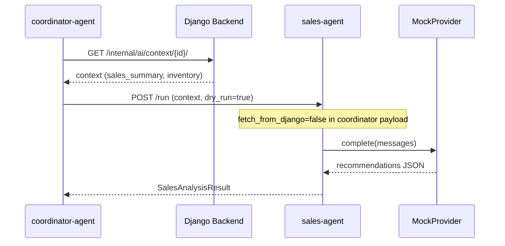
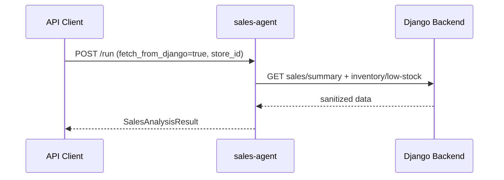

# Sales Agent

## 1. Purpose

The **sales-agent** (`SERVICE_NAME = "sales-agent"`) analyzes store sales and inventory data to produce schema-validated `SalesAnalysisResult` recommendations. It suggests restock, discount, and follow-up actions with priority scores (1–5). Recommendations are review-only; the agent does not change prices, inventory, or execute actions unless optional Django action persistence is explicitly requested on `/run`.

Primary responsibilities (from `agents/sales/analysis.py` and `agents/sales/app/main.py`):

- Optionally fetch sales summary and low-stock inventory from Django internal APIs.
- Merge caller/coordinator context with fetched data.
- Return deterministic empty-sales results without LLM when sales data is empty.
- Run LLM analysis for non-empty sales via `MockProvider` (default).
- Validate all outputs against `SalesAnalysisResult` before return.
- Optionally map and persist actions to Django (`persist_actions` flag).

## 2. Current Implementation Summary

### FastAPI app structure

| Item | Location |
|------|----------|
| App entrypoint | `agents/sales/app/main.py` |
| Request schemas | `agents/sales/app/schemas.py` — `SalesRunRequest` |
| Response schema | `agents/shared/schemas/sales.py` — `SalesAnalysisResult` |
| Runtime pipeline | `agents/sales/analysis.py` — `run_sales_analysis()` |
| Default port (Docker) | `8101` |

### Main modules/files

| Module | Role |
|--------|------|
| `agents/sales/analysis.py` | Main pipeline: fetch → merge → empty check → LLM → validate |
| `agents/sales/django_fetch.py` | `fetch_sales_context_with_fallback()` — Django GET with safe warnings |
| `agents/sales/sales_context.py` | `resolve_sales_run_context()` — deterministic context merge |
| `agents/sales/empty_sales.py` | `handle_empty_sales()`, `extract_sales_summary()` |
| `agents/sales/inventory_signals.py` | `build_sales_analysis_payload()` for LLM input |
| `agents/sales/prompts.py` | `build_sales_analysis_messages()` with priority rubric |
| `agents/sales/validation.py` | Parse/validate LLM JSON → `SalesAnalysisResult` |
| `agents/sales/action_mapping.py` | `map_sales_recommendation_to_action_payload()`, `persist_sales_actions()` |

### Routers/endpoints

All routes on `app` in `agents/sales/app/main.py`.

### External dependencies

- **Django** (optional): `GET /internal/ai/stores/{id}/sales/summary/`, `GET /internal/ai/stores/{id}/inventory/low-stock/` via `DjangoClient`.
- **Django actions** (optional): `POST /internal/ai/actions/` when `persist_actions=True`.
- **LLM**: `MockProvider` via `LLM_PROVIDER=mock`.

### Environment variables

| Variable | Used by | Notes |
|----------|---------|-------|
| `LLM_PROVIDER` | `get_llm_provider()` | Default `mock` |
| `AI_OUTPUT_LANGUAGE` | Prompt generation | Default `fa` |
| `DJANGO_INTERNAL_BASE_URL` | `DjangoClient` | Required when Django client is built |
| `DJANGO_CLIENT_TIMEOUT_SECONDS` | `DjangoClient` | Default `30` |
| `DJANGO_CLIENT_MAX_RETRIES` | `DjangoClient` | Default `2` (GET only) |
| `DJANGO_CLIENT_RETRY_BACKOFF_SECONDS` | `DjangoClient` | Default `0.25` |
| `JWT_SERVICE_TOKEN` | `_build_django_client()` fallback | Used when no token in request/header |

## 3. Public API / Endpoints

| Method | Path | Auth | Response model |
|--------|------|------|----------------|
| `GET` | `/health` | None | `{"status": "ok", "service": "sales-agent"}` |
| `GET` | `/` | None | Placeholder message |
| `POST` | `/run` | Optional `Authorization: Bearer`, `X-Request-ID` | `SalesAnalysisResult` |

### `POST /run`

**Request body** (`SalesRunRequest`):

| Field | Type | Required | Default | Description |
|-------|------|----------|---------|-------------|
| `context` | `dict` | Optional | `None` | Coordinator/Django context |
| `sales_summary` | `dict` | Optional | `None` | Explicit sales summary |
| `inventory` | `dict` | Optional | `None` | Explicit inventory data |
| `store_id` | `str` | Optional | `None` | Required for Django fetch |
| `report_run_id` | `str` | Optional | `None` | Metadata correlation |
| `output_language` | `str` | Optional | `None` | `fa`/`en` |
| `request_id` | `str` | Optional | `None` | Correlation ID |
| `fetch_from_django` | `bool` | Optional | `False` | Fetch sales/inventory from Django |
| `persist_actions` | `bool` | Optional | `False` | POST mapped actions to Django |
| `dry_run` | `bool` | Optional | `False` | Map actions but do not POST |
| `service_token` | `str` | Optional | `None` | Service JWT for Django client |

**Headers**:

| Header | Required | Notes |
|--------|----------|-------|
| `Authorization` | Optional | `Bearer <token>` used if `service_token` not in body |
| `X-Request-ID` | Optional | Correlation ID override |

**Status codes**:

| Code | When |
|------|------|
| `200` | Successful analysis (may include `warnings` in body) |
| `422` | Schema validation or LLM output errors; action mapping errors (`code: "action_mapping_failed"`) |
| `422` | Invalid request body (Pydantic) |
| `501` | `NotImplementedError` (e.g. unsupported `LLM_PROVIDER`) — `code: "not_implemented"` |

**Side effects**:

- INFO log per request.
- Optional Django GET (fetch) and POST (action persistence).
- Warnings appended to result for fetch failures, dry-run, persistence failures (HTTP 200 still returned).

## 4. Inputs

| Input | Type | Required | Validation | Used in |
|-------|------|----------|------------|---------|
| `context` | `dict` | Optional | Strict model | `resolve_sales_run_context()` |
| `sales_summary` | `dict` | Optional | — | Sales analysis |
| `inventory` | `dict` | Optional | — | Restock signals |
| `store_id` | `str` | Optional | Required for Django fetch | `django_fetch` |
| `fetch_from_django` | `bool` | Optional | Default `False` | Triggers Django GET |
| `persist_actions` | `bool` | Optional | Default `False` | Triggers action POST |
| `dry_run` | `bool` | Optional | Default `False` | Map without POST |
| `service_token` / `Authorization` | `str` | Optional | Bearer scheme | `DjangoClient` auth |
| `output_language` | `str` | Optional | `fa`/`en` | Prompts |
| `AI_OUTPUT_LANGUAGE` | env | Optional | Default `fa` | When language omitted |
| `LLM_PROVIDER` | env | Optional | `mock` | LLM selection |

## 5. Outputs

| Output | Shape | When | Consumer |
|--------|-------|------|----------|
| `SalesAnalysisResult` | JSON | Successful `/run` | Coordinator, API clients |
| `warnings[]` in result | `{code, message}` | Fetch failure, dry-run, persistence skipped/failed | UI, coordinator merge |
| `422` error detail | Structured codes | Validation/mapping failure | API client |
| `501` error detail | `{code: "not_implemented"}` | Unsupported LLM provider | API client |
| Django action records | Via internal API | `persist_actions=True` and client configured | Django action workflow |
| INFO/WARNING logs | Structured | Request and validation failures | Operations |

## 6. Behavior Flow

1. **Request received** — `run_sales_agent()` resolves `request_id`, extracts `service_token` from body or `Authorization` header.
2. **Django client** — Built when `fetch_from_django` or `persist_actions` is true and a token is available.
3. **Pipeline** — `run_sales_analysis()`:
   - `fetch_sales_context_with_fallback()` if `fetch_from_django`.
   - `resolve_sales_run_context()` merges explicit and Django context.
   - `handle_empty_sales()` short-circuits without LLM when sales are empty.
   - `build_sales_analysis_payload()` + LLM + validation for non-empty path.
4. **Action persistence** (if `persist_actions`):
   - No client → warning `action_persistence_skipped`.
   - `persist_sales_actions()` maps recommendations → Django POST.
   - `dry_run=True` → warning `dry_run`, no POST.
   - Mapping error → HTTP 422; Django HTTP/client error → warning on 200 response.
5. **Return** — `SalesAnalysisResult` with accumulated warnings.

## 7. Flowchart

## 8. Sequence Diagram

Coordinator daily-report path (typical production flow):

Direct call with Django fetch enabled:

## 9. Error Handling

| Error path | Behavior |
|------------|----------|
| Pydantic request validation | HTTP `422` |
| `AgentSchemaValidationError` / `SalesLLMOutputError` | HTTP `422` with structured detail |
| `SalesActionMappingError` | HTTP `422`, `code: "action_mapping_failed"` |
| `DjangoHTTPError` / `DjangoClientError` during persistence | Warning on result, HTTP `200` |
| Missing Django client when persistence requested | Warning `action_persistence_skipped`, HTTP `200` |
| `NotImplementedError` (LLM provider) | HTTP `501` |
| Django fetch failure | Warning in result, continues with caller context (`django_fetch_failed` — Inferred from sales `django_fetch.py` pattern) |
| Empty sales | Valid response, empty `recommendations`, no LLM |

Django client retries transient GET failures (502/503/504, connection, timeout) up to `DJANGO_CLIENT_MAX_RETRIES`. POST to actions does not retry by default.

## 10. Data Contracts

### `SalesRunRequest`

| Field | Type | Required | Default |
|-------|------|----------|---------|
| `context` | `dict \| None` | Optional | `None` |
| `sales_summary` | `dict \| None` | Optional | `None` |
| `inventory` | `dict \| None` | Optional | `None` |
| `store_id` | `str \| None` | Optional | `None` |
| `report_run_id` | `str \| None` | Optional | `None` |
| `output_language` | `str \| None` | Optional | `None` |
| `request_id` | `str \| None` | Optional | `None` |
| `fetch_from_django` | `bool` | Optional | `False` |
| `persist_actions` | `bool` | Optional | `False` |
| `dry_run` | `bool` | Optional | `False` |
| `service_token` | `str \| None` | Optional | `None` |

### `SalesAnalysisResult`

| Field | Type | Required | Default | Description |
|-------|------|----------|---------|-------------|
| `metadata` | `AgentResponseMetadata` | Required | — | `agent_name`, `report_run_id` |
| `warnings` | `list[AgentWarning]` | Optional | `[]` | Pipeline warnings |
| `summary` | `str` | Required | — | Analysis summary |
| `insights` | `list[str]` | Optional | `[]` | Additional insight strings |
| `recommendations` | `list[SalesRecommendation]` | Optional | `[]` | Action suggestions |

### `SalesRecommendation`

| Field | Type | Required | Description |
|-------|------|----------|-------------|
| `priority` | `int` | Required | 1 (urgent) to 5 (informational) |
| `action_type` | `"sales.restock" \| "sales.discount" \| "sales.follow_up"` | Required | Allowed types only |
| `title` | `str` | Required | Manager-facing title |
| `description` | `str` | Required | Short summary |
| `rationale` | `str` | Required | Non-PII justification |
| `payload` | `dict` | Optional | e.g. `sku`, `product_id`, `suggested_order_qty` |

## 11. Dependencies and Integrations

### Python packages (`agents/sales/requirements.txt`)

- `fastapi`, `pydantic`, `uvicorn` (same versions as content-agent)
- Uses `httpx` transitively via `agents/shared/django_client`

### Django internal endpoints

| Method | Path | When |
|--------|------|------|
| `GET` | `/internal/ai/stores/{store_id}/sales/summary/` | `fetch_from_django=True` |
| `GET` | `/internal/ai/stores/{store_id}/inventory/low-stock/` | `fetch_from_django=True` |
| `POST` | `/internal/ai/actions/` | `persist_actions=True` and not `dry_run` |

### Other agents

- Called by coordinator only. Does not call content or support agents.

### Environment variables

`LLM_PROVIDER`, `AI_OUTPUT_LANGUAGE`, `DJANGO_INTERNAL_BASE_URL`, `DJANGO_CLIENT_*`, `JWT_SERVICE_TOKEN`

## 12. Current Limitations

- **Coordinator disables Django fetch and persistence** — `_sales_specialist_payload()` sets `fetch_from_django: False`, `persist_actions: False`, `dry_run: True`.
- **Mock LLM only** in `get_llm_provider()`.
- **No JWT validation inside FastAPI** — token is forwarded to Django; invalid tokens fail at Django layer.
- **Action persistence is opt-in** — not automatic on every `/run`.
- **Placeholder `GET /`** endpoint.
- **Coordinator forces `output_language: "en"`** in specialist base payload.

## 13. Frontend-Relevant Notes

- **Primary consumer**: coordinator during daily reports; direct `/run` usable for testing or custom integrations.
- **Display**: `summary`, `recommendations[].title`, `priority`, `action_type`, `rationale`, `warnings`.
- **Priority UI**: Map 1–5 to urgency labels (1 = highest per prompt rubric in `agents/sales/prompts.py`).
- **Actions**: Recommendations are suggestions only unless `persist_actions` is used; coordinator does not persist via sales-agent today.
- **Errors**: Handle `422` validation and `501` not-implemented; check `warnings` on `200` for partial failures.
- **Auth**: Pass `Authorization: Bearer <service_jwt>` or `service_token` in body for Django-backed modes.
- **Sync only**: No streaming or job status endpoint.

## 14. Verification Checklist

- [x] Agent directory inspected
- [x] FastAPI routes documented
- [x] Inputs documented
- [x] Outputs documented
- [x] Main behavior flow documented
- [x] Flowchart added
- [x] Error handling documented
- [x] Frontend-relevant notes added
- [x] No application code changed
