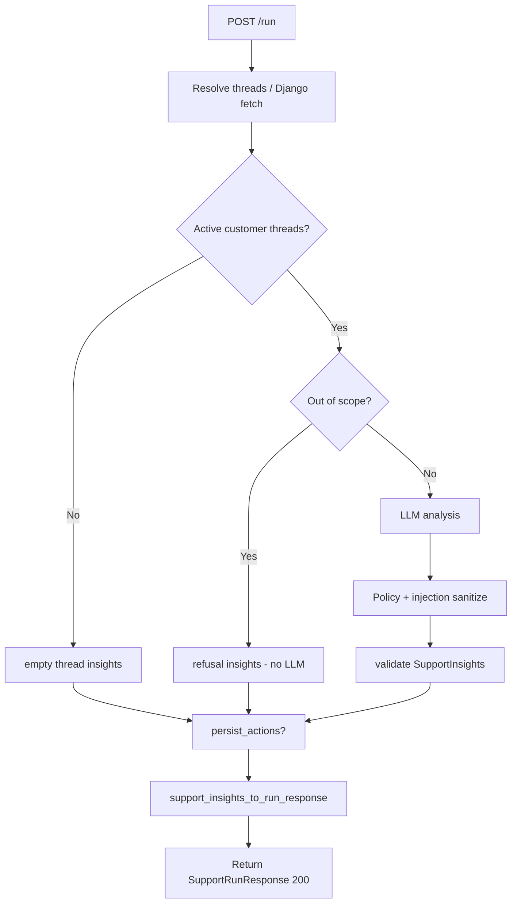
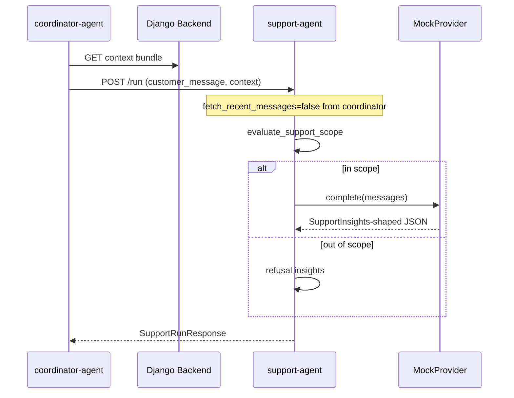
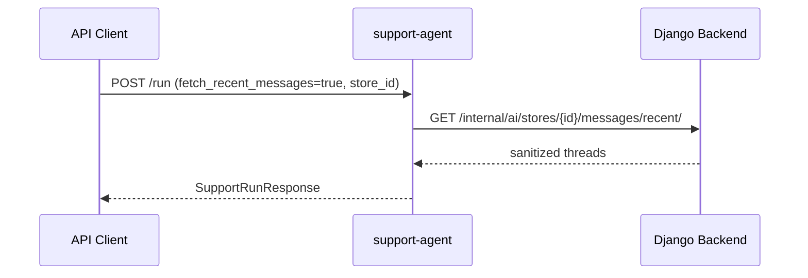

# Support Agent

## 1. Purpose

The **support-agent** (`SERVICE_NAME = "support-agent"`) analyzes sanitized customer support message threads and produces structured support insights with per-thread reply drafts. It applies deterministic approval policy, refusal/scope guardrails, and prompt-injection defenses. All customer contact remains draft-only; the agent does not send messages, process refunds, or mutate orders.

Primary responsibilities (from `agents/support/analysis.py` and `agents/support/app/main.py`):

- Resolve sanitized thread context from request body, caller context, or optional Django fetch.
- Refuse out-of-scope requests deterministically (sales, content, order mutation, etc.).
- Summarize themes and sentiment without leaking PII.
- Generate `reply_drafts[]` with per-draft approval metadata via LLM (`MockProvider` default).
- Validate output as `SupportInsights`, then adapt to legacy `SupportRunResponse` for the HTTP API.
- Optionally map and persist support actions to Django.

## 2. Current Implementation Summary

### FastAPI app structure

| Item | Location |
|------|----------|
| App entrypoint | `agents/support/app/main.py` |
| Request schemas | `agents/support/app/schemas.py` — `SupportRunRequest` |
| HTTP response schema | `agents/shared/schemas/support.py` — `SupportRunResponse` |
| Internal pipeline schema | `SupportInsights` (converted before HTTP return) |
| Runtime pipeline | `agents/support/analysis.py` — `run_support_analysis()` |
| Default port (Docker) | `8103` |

### Main modules/files

| Module | Role |
|--------|------|
| `agents/support/analysis.py` | Full runtime pipeline |
| `agents/support/support_context.py` | `resolve_support_message_context()` — thread merge |
| `agents/support/django_fetch.py` | `fetch_message_threads_with_fallback()` |
| `agents/support/approval_policy.py` | `evaluate_support_approval_policy()` |
| `agents/support/refusal.py` | `evaluate_support_scope()`, out-of-scope detection |
| `agents/support/injection_guard.py` | Untrusted message wrapping and output sanitization |
| `agents/support/prompts.py` | `build_support_analysis_messages()` |
| `agents/support/validation.py` | Parse, validate, `support_insights_to_run_response()` |
| `agents/support/action_mapping.py` | `persist_support_actions()` |

### External dependencies

- **Django** (optional): `GET /internal/ai/stores/{id}/messages/recent/`
- **Django actions** (optional): `POST /internal/ai/actions/`
- **LLM**: `MockProvider` via `LLM_PROVIDER=mock`

### Environment variables

| Variable | Used by | Notes |
|----------|---------|-------|
| `LLM_PROVIDER` | `get_llm_provider()` | Default `mock` |
| `AI_OUTPUT_LANGUAGE` | Default user-facing text | Default `fa` |
| `DJANGO_INTERNAL_BASE_URL` | `DjangoClient` | Required when client built |
| `DJANGO_CLIENT_*` | `DjangoClient` | Timeout/retry settings |
| `JWT_SERVICE_TOKEN` | `_build_django_client()` fallback | When no request token |

## 3. Public API / Endpoints

| Method | Path | Auth | Response model |
|--------|------|------|----------------|
| `GET` | `/health` | None | `{"status": "ok", "service": "support-agent"}` |
| `GET` | `/` | None | Placeholder message |
| `POST` | `/run` | Optional `Authorization: Bearer`, `X-Request-ID` | `SupportRunResponse` |

### `POST /run`

**Request body** (`SupportRunRequest`):

| Field | Type | Required | Default | Description |
|-------|------|----------|---------|-------------|
| `customer_message` | `str` | **Required** | — | Min length 1; used when no threads provided |
| `channel` | `str` | **Required** | — | e.g. `instagram_dm` |
| `tenant_id` | `str` | Optional | `None` | Tenant scope metadata |
| `store_id` | `str` | Optional | `None` | Required for Django message fetch |
| `metadata` | `dict` | Optional | `None` | Extra request metadata |
| `report_run_id` | `str` | Optional | `None` | Report correlation |
| `output_language` | `str` | Optional | `None` | `fa`/`en` |
| `request_id` | `str` | Optional | `None` | Correlation ID |
| `context` | `dict` | Optional | `None` | Coordinator context bundle |
| `message_threads` | `list[dict]` | Optional | `None` | Explicit sanitized threads |
| `fetch_recent_messages` | `bool` | Optional | `False` | Django thread fetch |
| `persist_actions` | `bool` | Optional | `False` | POST actions to Django |
| `dry_run` | `bool` | Optional | `False` | Map without POST |
| `service_token` | `str` | Optional | `None` | Service JWT |

**Note**: `customer_message` and `channel` are always required by schema even when `message_threads` or coordinator `context` supplies thread data.

**Status codes**:

| Code | When |
|------|------|
| `200` | Successful analysis (including refusal and empty-thread paths) |
| `422` | Schema/LLM validation errors; `support_action_mapping_failed` |
| `422` | Invalid request body |
| `501` | `NotImplementedError` (unsupported LLM provider) |

**Side effects**: INFO/WARNING logs; optional Django GET/POST; pipeline warnings logged at WARNING level.

## 4. Inputs

| Input | Type | Required | Validation | Used in |
|-------|------|----------|------------|---------|
| `customer_message` | `str` | Required (schema) | `min_length=1` | Synthesized thread if no threads |
| `channel` | `str` | Required (schema) | `min_length=1` | Thread channel metadata |
| `message_threads` | `list[dict]` | Optional | Merged into `SupportMessageThreadContext` | Thread analysis |
| `context` | `dict` | Optional | May contain `message_threads` | Coordinator bundle |
| `fetch_recent_messages` | `bool` | Optional | Triggers Django GET | `django_fetch` |
| `store_id` | `str` | Optional | Needed for fetch | Django endpoint path |
| `persist_actions` / `dry_run` | `bool` | Optional | — | Action persistence |
| `service_token` / `Authorization` | `str` | Optional | Bearer | Django client |
| `AI_OUTPUT_LANGUAGE` | env | Optional | Default `fa` | Summaries and replies |

## 5. Outputs

| Output | Shape | When | Consumer |
|--------|-------|------|----------|
| `SupportRunResponse` | JSON (HTTP) | Every successful `/run` | Coordinator, API clients |
| Internal `SupportInsights` | Not returned directly | Pipeline intermediate | Adapted by `support_insights_to_run_response()` |
| `warnings[]` | In response and logs | Fetch failures, refusal, empty threads, persistence | UI, coordinator |
| Django actions | Via internal API | `persist_actions=True` | Django approval workflow |
| Refusal output | `status: "refused"` in `SupportRunResponse` | Out-of-scope customer message | Coordinator merge |

### `SupportRunResponse` fields (HTTP)

| Field | Description |
|-------|-------------|
| `agent` | Always `"support-agent"` |
| `status` | `"ok"`, `"refused"`, or values from legacy paths |
| `language` | Resolved output language |
| `reply` | Primary draft `reply_text` (first `reply_drafts[]` item) |
| `intent` | `matched_policy_code` from primary draft |
| `confidence` | `1.0` for refusal; `0.92`/`0.85` otherwise |
| `requires_human_review` | `false` for refusal; `true` if any draft requires approval |
| `request_id` | Correlation ID |
| `warnings` | Pipeline warnings |

**Limitation**: Full `reply_drafts[]`, `themes`, and `sentiment` from `SupportInsights` are **not** exposed on the HTTP response — only the primary draft is surfaced in `reply` (documented limitation for frontend).

## 6. Behavior Flow

1. **Request received** — token and `request_id` resolved; Django client built if fetch or persist requested.
2. **Thread context** — `_resolve_thread_context()`:
   - Optional Django fetch → merge with caller threads.
   - If no threads and `customer_message` present → synthesize single-thread context.
3. **Empty threads** — `_build_empty_thread_insights()` (escalation draft, warning `no_support_threads_available`).
4. **Refusal check** — `evaluate_support_scope()` on latest customer message per thread; refusal → `_build_refusal_insights()` without LLM.
5. **LLM path** — `build_support_analysis_messages()` → LLM → `_normalize_llm_insights()` with approval policy and injection sanitization → `ensure_valid_support_insights()`.
6. **Action persistence** (optional) — same pattern as sales-agent with support-specific warning codes.
7. **Response adaptation** — `support_insights_to_run_response()` maps `SupportInsights` → `SupportRunResponse`.
8. **Log warnings** — each insight warning logged at WARNING level.

## 7. Flowchart

## 8. Sequence Diagram

With Django message fetch (direct API use):

## 9. Error Handling

| Error path | Behavior |
|------------|----------|
| Pydantic request validation | HTTP `422` |
| `AgentSchemaValidationError` / `SupportLLMOutputError` | HTTP `422` with structured detail |
| `SupportActionMappingError` | HTTP `422`, `code: "support_action_mapping_failed"` |
| Django persistence failure | Warning `support_action_persistence_failed`, HTTP `200` |
| Missing Django client for persistence | Warning `support_action_persistence_skipped` |
| `NotImplementedError` | HTTP `501` |
| Django fetch failure | Warning `django_fetch_failed` (Inferred from `django_fetch.py`), continues with caller context |
| Out-of-scope message | HTTP `200`, `status: "refused"`, warning `support_out_of_scope_refusal` |
| Empty threads | HTTP `200`, escalation draft, warning `no_support_threads_available` |

## 10. Data Contracts

### `SupportRunRequest`

See section 3. All fields use `StrictAgentModel` (`extra="forbid"`).

### `SupportInsights` (pipeline output, not direct HTTP response)

| Field | Type | Required | Description |
|-------|------|----------|-------------|
| `metadata` | `AgentResponseMetadata` | Required | `agent_name`, `report_run_id` |
| `warnings` | `list[AgentWarning]` | Optional | Pipeline warnings |
| `summary` | `str` | Required | PII-safe summary |
| `themes` | `list[str]` | Optional | Support theme codes |
| `sentiment` | `SupportAggregateSentiment` | Required | `label`, optional `confidence` |
| `reply_drafts` | `list[SupportReplyDraft]` | Required | Min length 1 |
| `output_language` | `str \| None` | Optional | `fa`/`en` |

### `SupportReplyDraft`

| Field | Type | Required | Description |
|-------|------|----------|-------------|
| `thread_ref` | `str` | Required | Thread identifier |
| `reply_text` | `str` | Required | Draft reply body |
| `action_type` | `"support.reply_draft" \| "support.escalate"` | Required | Allowed types only |
| `requires_approval` | `bool` | Required | Must be true for escalate/high-risk |
| `risk_level` | `"low" \| "medium" \| "high"` | Required | Risk classification |
| `matched_policy_code` | `str` | Required | Policy identifier |
| `safety_notes` | `list[str]` | Optional | Safety metadata |
| `reason` | `str \| None` | Optional | Classification reason |
| `rationale` | `str \| None` | Optional | Draft rationale |
| `language` | `str \| None` | Optional | Draft language |

### `SupportRunResponse` (HTTP response)

| Field | Type | Required | Default |
|-------|------|----------|---------|
| `agent` | `str` | Optional | `"support-agent"` |
| `status` | `str` | Required | — |
| `language` | `str` | Required | — |
| `reply` | `str` | Required | — |
| `intent` | `str` | Required | — |
| `confidence` | `float` | Required | 0.0–1.0 |
| `requires_human_review` | `bool` | Required | — |
| `request_id` | `str \| None` | Optional | `None` |
| `warnings` | `list[AgentWarning]` | Optional | `[]` |

## 11. Dependencies and Integrations

### Python packages (`agents/support/requirements.txt`)

- `fastapi`, `pydantic`, `uvicorn`

### Django internal endpoints

| Method | Path | When |
|--------|------|------|
| `GET` | `/internal/ai/stores/{store_id}/messages/recent/` | `fetch_recent_messages=True` |
| `POST` | `/internal/ai/actions/` | `persist_actions=True` |

### Other agents

- Called by coordinator only. Does not call sales or content agents.

### Policy modules (deterministic, no LLM)

- `agents/support/approval_policy.py` — auto vs approval-required classification
- `agents/support/refusal.py` — out-of-scope refusal codes
- `agents/support/injection_guard.py` — prompt-injection hardening

## 12. Current Limitations

- **HTTP response is legacy envelope** — `SupportRunResponse` exposes only primary `reply`, not full `reply_drafts[]` or `sentiment` object.
- **Coordinator does not enable Django fetch** — `fetch_recent_messages: False` in `_support_specialist_payload()`; derives `customer_message` from context or defaults to `"What are your store hours?"`.
- **`customer_message` always required** in request schema even when threads are provided.
- **Mock LLM only** in production code path.
- **Coordinator sets `dry_run: True`, `persist_actions: False`** for support runs.
- **Merge layer uses simplified support shape** — `build_support_insights()` in coordinator `merge.py` reads `themes`/`summary` from dict; coordinator receives `SupportRunResponse` shape from specialist HTTP client (Inferred from code: specialist client returns JSON dict as-is; merge may use fallback fields like `intent`).

## 13. Frontend-Relevant Notes

- **Usable endpoint**: `POST /run` for support analysis (coordinator is primary caller).
- **Display from HTTP response**: `reply`, `status`, `intent` (policy code), `requires_human_review`, `confidence`, `warnings`, `language`.
- **Refusal UI**: When `status === "refused"`, show `reply` as safe refusal text; `requires_human_review` is `false` but escalation draft may exist internally.
- **Approval UI**: When `requires_human_review === true`, show pending manager review state.
- **Not available on HTTP**: full thread list, all drafts, sentiment object — would require API contract change or coordinator merge data.
- **Required payload**: Always send `customer_message` and `channel` even if using `message_threads`.
- **Auth**: `Authorization: Bearer` or `service_token` for Django-backed modes.
- **Sync only**: No streaming.

## 14. Verification Checklist

- [x] Agent directory inspected
- [x] FastAPI routes documented
- [x] Inputs documented
- [x] Outputs documented
- [x] Main behavior flow documented
- [x] Flowchart added
- [x] Error handling documented
- [x] Frontend-relevant notes added
- [x] No application code changed
